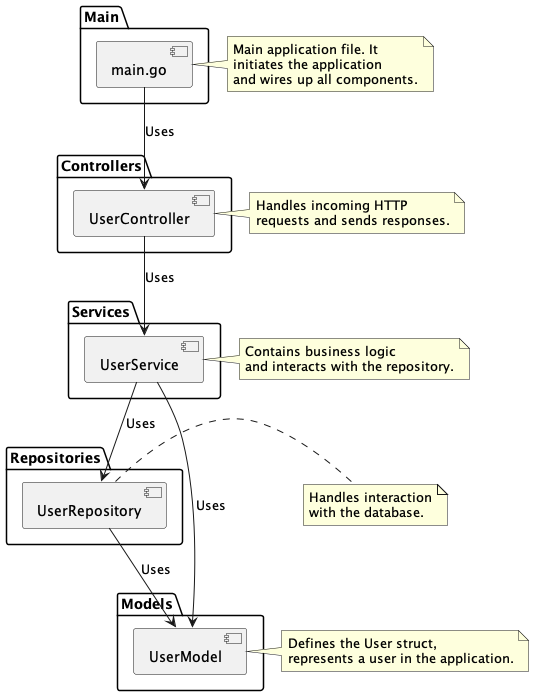

# PEKEN Backend

This app is for learning purpose. Here I will learn about Golang with [Gin Web Framework](https://gin-gonic.com/)

## Requirements

- Golang
- PostgreSQL

### Environtment

To prepare the environment for building and running the application, please follow these steps:

- Create a new file with the name `.env`.
- Copy all the variables from the `.baseEnv` file.
- Paste the copied variables into the `.env` file.
- Edit the values of the variables in the `.env` file to match your configuration.

This will ensure that the application is properly configured before building and running it.

## Build, Run and Run Test

Building the application

```bash
$ make build
```

Running the application

```bash
$ make run-dev
```

Running the test case

```bash
$ make run-test
```

### Project Structure

In this project, I'm using MVC structure with Dependency Injection support using [Google Wire](https://github.com/google/wire) library. Here is the structure that I used:



Source Image from: https://medium.com/@adamszpilewicz/golang-web-application-with-mvc-like-structure-using-gin-and-pgx-dc19132adc12
